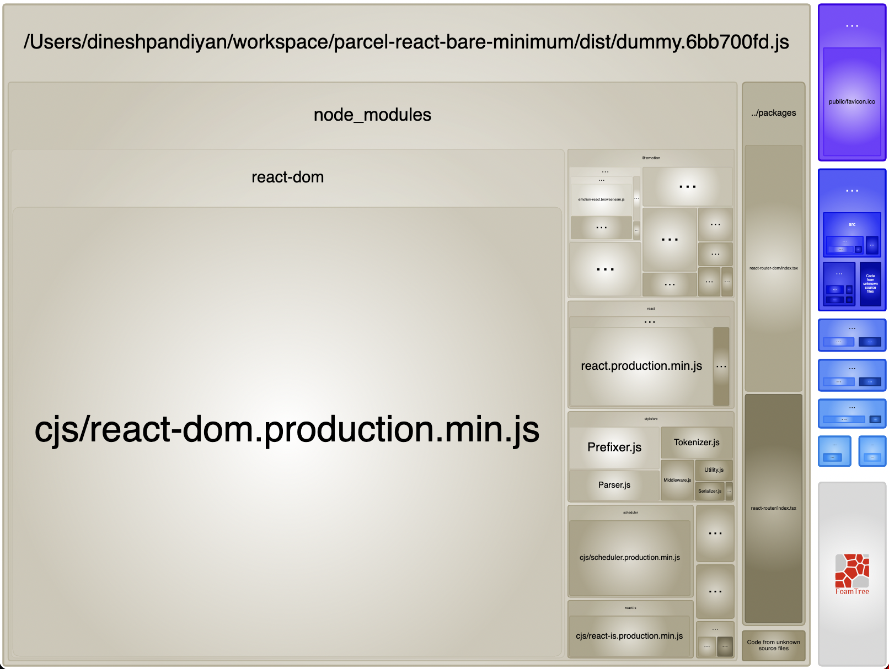

# Extract vendors into separate bundle with Parcel bundler

This repo is an example to separate vendors into a separate bundle with parcel. There's no straightforward API way to do this with parcel. So we create a dummy html with dummy react root and import all the vendors we need to be extracted into a separate bundle for our app.

This works based on the concept of shared bundles in parcel.

https://parceljs.org/features/code-splitting/#shared-bundles

## Stack

- Typescript
- Parcel 2
- React 17
- Emotion
- React Router
- React Lazy Loading

## Built bundles

The brown part is the vendor bundle with all the packages we want to be extracted (react, react router, emotion) and the blue parts are page bundles. Page bundles get rehashed on every new build while vendor bundle remains the same between builds until one of the package version is upgraded. This helps with CDN caching of vendor bundles between builds.

